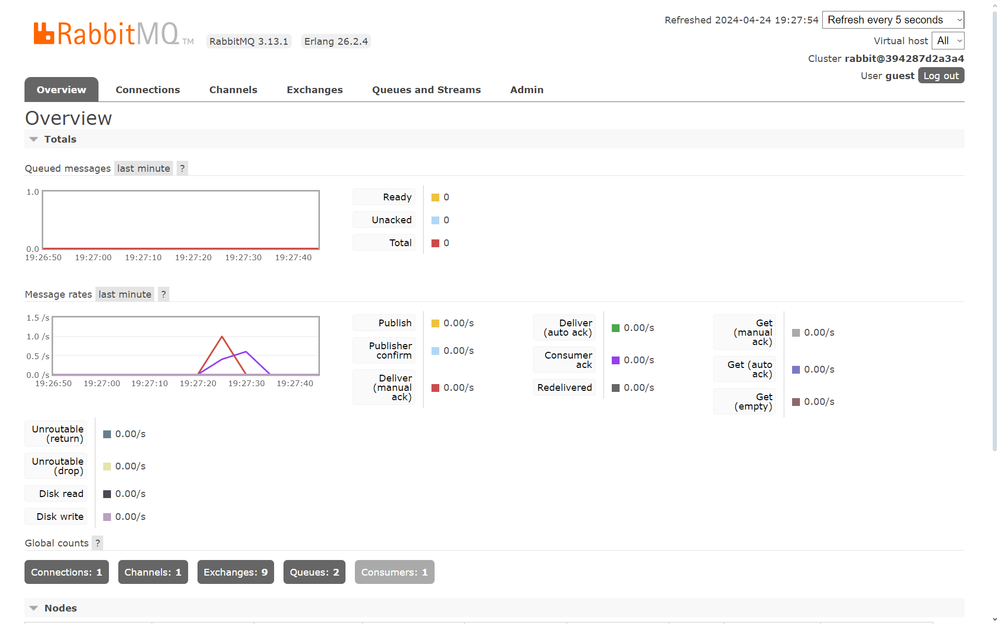
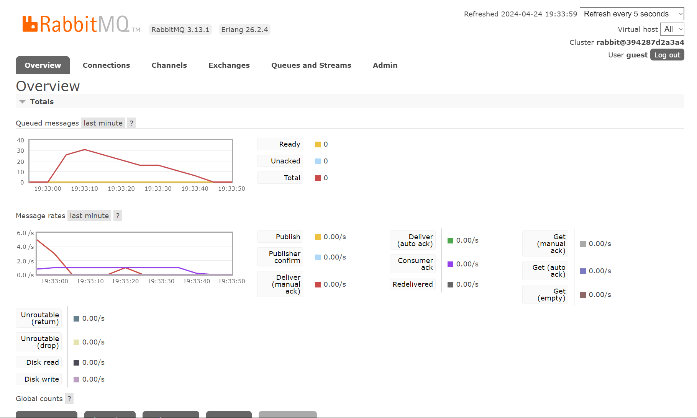

# What is amqp?
AMQP (Advanced Message Queuing Protocol) is a protocol for message-oriented middleware. The defining features of AMQP are message orientation, queuing, routing (including point-to-point and publish-and-subscribe), reliability and security. In our code, we use the AMQP protocol to send and receive messages between the client and the server.

# what it means? guest:guest@localhost:5672, what is the first quest, and what is the second guest, and what is localhost:5672 is for? 
This is commonly known as connection string. In AMQP, the common format for the connection string is `username:password@host:port`.Hence, the first `guest` is the username and the second `guest` is the password. The `localhost:5672` is the host and port number. The default port number for AMQP is 5672.

The message queue builds up when the subscriber simulation runs slowly. This happens because subscribers can only process messages as fast as the simulation allows. Since publishers keep sending messages, any messages that subscribers can't handle yet get stuck in the queue. This queue acts as a holding area until subscribers are ready to receive them again.

The speed at which the message queue empties depends on how many subscribers are present. With a single subscriber, messages can only be processed one at a time, leading to a slower drain on the queue. Conversely, if there are many subscribers, they act like multiple checkout lanes at a store. Messages can be processed simultaneously by these subscribers, significantly increasing the speed at which messages exit the queue. This results in a much faster overall processing rate for the messages published to the system.

To speed up the processing of messages, you can add more subscribers to the system. This will allow messages to be processed in parallel, reducing the time it takes to clear the message queue. However, adding more subscribers also increases the complexity of the system, as you need to manage the interactions between the different subscribers. You also need to ensure that the system can handle the increased load generated by the additional subscribers.